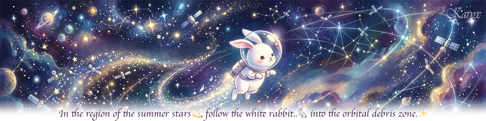

<div align="center">
  <h3>Space-Track TLE Data Pipeline & Collision Avoidance MLOps System using Airflow, MLflow, Kubernetes and FastAPI</h3>
</div>

## **🎥 Feature Highlights**
<p align="center">
</p>
<p align="center">
</p>

## **🛰️ Project Info**
### Data Collection
- Space-Track.org(CSpOC)에서 지구 궤도 위성 및 로켓 잔해(space debris)의 위치와 궤도 요소(TLE) 데이터 확보
- GP (TLE) 데이터는 LEO 기준 하루 2~4회 정도만 갱신되며 호출 권장 주기는 1시간에 1회
- 호출 횟수 제한: 분당 최대 30회 / 시간당 최대 300회
- 예측 기간 제한: SGP4/TLE 특성상 오차가 누적되므로, 향후 3~7일 이내의 단기 충돌 위험 1차 경보 시스템에 초점을 맞춤

### Tech Stack
- Airflow (데이터 파이프라인, 오케스트레이션)
- S3 (데이터 적재, MLflow)
- PyTorch Lightning (모델 학습)
- W&B (MLflow)
- FastAPI (추론 서빙)
- Minikube/EKS (K8s) & GitHub Actions (CI/CD 자동 배포)

---

## **🎬 MLOps Scenario**
### STEP 1. [수집] Data Ingestion (Airflow)
- Space-Track REST API 호출
- 관심 발사체/위성군(eg. Starlink, LEO 우주쓰레기)의 TLE 전체 카탈로그(약 35,000건)를 주기적으로 증분 수집
- 원본 JSON를 S3 raw 적재 (s3://my-bucket/raw/year=2026/month=08/day=22/tle_raw_020100.json)

### STEP 2. [전처리/가공] Preprocessing & Feature Engineering
- SGP4 및 Skyfield 라이브러리를 사용하여 좌표 변환: TLE → ECI → ECEF → LLA
- 데이터 검증: 스키마/결측치/값범위 체크
- 심우주·달궤도 객체 필터링: ALT_KM > 50,000km 제외, GEO/HEO는 유지
- 궤도 요소 기반 변동치: 경사각 $i$, 편심률 $e$, 근지점인구각 $\omega$, 평균운동 $n$ 등에서 계산하는 이상 변동치
- Screening Engine: 궤도 유사군으로 1차 필터링. KDTree 기반 공간 인덱스 (전체 조합 대신 근접 후보만 빠르게 추출)
- 상대 거리 계산: 두 객체간 거리가 설정한 근접 임계치 이내인지 평가하여 충돌 위험 후보군 선별
- Parquet 포맷 변환 후 S3 processed 적재 (s3://my-bucket/processed/year=2026/month=08/day=22/tle_processed_020100.parquet)

### STEP 3. [학습/등록] Model Training & Registry (LSTM Autoencoder/MLflow)

---

## **💡 Insights from Trial and Error**
- [STEP 1] 프로토타입 테스트에서는 EPOCH 필터링으로 최근 3일내 갱신된 객체 100건만 수집했으나 실제 활용을 위해 전체 카탈로그 수집으로 변경. 그러면 모든 pairwise 거리 계산은 조합 수가 억 단위라 브루트포스로는 불가능하므로 CelesTrak, Socrates같은 실제 충돌 스크리닝 시스템처럼 궤도 유사군(고도대/경사각 등)으로 1차 필터링하고 KDTree로 근접 후보만 빠르게 추출

- [STEP 2] 궤도 요소 기반 변동치
  - 궤도 요소 (경사각/이심률/근지점인구각/승교점적경/평균운동/BSTAR) 기반 변화율: 스케줄링(1시간) 간격으로 비교했더니 35,052개 중 35,051개가 EPOCH 완전히 동일. TLE 데이터는 하루 2~4회 정도만 갱신됨을 확인 후 24시간전 스냅샷과 비교로 변경
  - 항상 "가장 최근 이전 파일 1개 vs 현재" 딱 2개만 비교하는데 매 실행마다 processed/ 전체 히스토리를 리스팅하고 있어서 오늘 + 어제 파티션만 리스팅하도록 변경하여 데이터가 쌓여도 조회 비용이 늘지 않게 유지
  - `DELTA_MEAN_MOTION_PER_HR`이 수백 단위로 튀는 사례 발견. dt_hours가 너무 작으면(수분~수초 단위) 나눗셈이 불안정해져서 정상적인 미세한 변화도 시간당 변화율로 환산하는 순간 비정상적으로 폭발할 수 있으므로 최소 간격 미만이면 변화율 계산 자체를 하지 않고 NaN 처리

- [STEP 2] MIN_DISTANCE_KM == 0 (35건): 버그 아니고 실제로 물리적으로 붙어있는 객체들. `MIN_DISTANCE_KM`이 각자 TLE epoch 기준 근사치고 공통 시점 propagate 아님<br>
eg. ISS 관련 25544/25575/26400/26700/36086: ISS는 모듈(Zarya, Unity, Zvezda, Destiny, Poisk)마다 별도 NORAD ID가 부여되지만 물리적으로 하나의 구조물이라 좌표가 동일

- [STEP 2] EPOCH이 미래 날짜인 건들 검출: 컨테이너에서 실제 시스템 시각 정상 여부 확인 후 raw json을 조회하니 실제로 Space-Track이 미래 epoch을 주고 있음. `MEAN_MOTION`이 모두 1.0 rev/day 미만이라 고고도 장주기 궤도(GTO/HEO/달 궤도 근접)인데, 지상 레이더가 한 궤도 도는 동안 관측할 기회 자체가 적어 원래 며칠~2주 앞선 epoch을 주는 게 정상 동작이라고 함. 차후 min_snapshots 조건에서 자동 필터링되므로 수정할 필요 없음

- [STEP 2] 신규 발사 위성(BSTAR 추정 불안정)에서 점수가 100% BSTAR 하나에 지배당하는 문제 확인되어 `ORBITAL_DEVIATION_METRIC`(원소별 델타를 고정 스케일로 합산한 단일 점수)은 모델 입력으로 쓰지 않기로 함. 대신 원소별 델타 6개 컬럼을 그대로 모델에 입력하여 LSTM Autoencoder가 정상 패턴을 스스로 학습하게 함

- [STEP 3] LSTM Autoencoder가 시계열 모델이므로 적어도 원본 실데이터는 꾸준히 적재하여 충분히 확보할 필요가 있음

- [STEP 3] EPOCH이 지나치게 오래된 TLE(수십 년간 갱신 안 된 객체, eg. 1965년 VENERA 2)는 실제 최신 궤도 상태를 반영 못하므로 제외. 30일 초과로 걸러진 2,733건 중 다수가 WESTFORD NEEDLES(1960년대 군사 실험 잔해 조각들)인데 위성에 타격이 안되는 미세한 구리바늘 쓰레기인지라 애초에 TLE API 수집 단계에서 이름으로 필터링 하는 것을 고려

- [STEP 3] LSTM Autoencoder val_loss 이상 급등: 원궤도(이심률≈0)에서는 "근지점"이라는 지점 자체가 물리적으로 잘 정의되지 않아서, `ARG_OF_PERICENTER`가 실제 궤도 변화와 무관하게 TLE 재피팅마다 크게 튐. 따라서 preprocessing에서 임계값 미만(원궤도)이면 ARG_OF_PERICENTER 델타를 NaN으로 처리

---

## **📜 Project Development Log**
### 2026-08-19
- Project Kickoff: Inspired by Rocket Lab (after watching the HBO documentary "Wild Wild Space")
- Came up with a concept while listening to The Enid's debut album:<br>
*"In the region of the summer stars💫, follow the white rabbit..🐇 into the orbital debris zone.✨"*
- Set up GitHub repository

### 2026-08-20 ~ 2026-08-21
- Sign up for Space-Track.org
- Set up the environment (WSL2, Docker, Airflow, etc.)
- Create an AWS S3 bucket

### 2026-08-22 ~ 2026-08-23
- 프로젝트 아키텍처 설계
- ingestion 스크립트 작성
- 프로토타입 개발분 테스트 위해 최근 객체 100건만 수집하여 적재
- Dockerfile 구현, 단일 실행 테스트

### 2026-08-24
- preprocessing 스크립트 작성 착수
- 전처리 단계에 해당하는 규칙 기반 알고리즘 로직 작성 위해 도메인 지식 습득
- uv run airflow standalone 테스트 확인

### 2026-08-25
- docker-compose.yaml 작성
- 전체 full catalog를 1시간 간격으로 수집하도록 스케줄링 테스트
- 필수 필드 존재 여부 샘플 체크 (첫 레코드 기준)

### 2026-08-26 ~ 2026-08-27
- 전처리, FE 2차 개발: 결과 데이터 확인하며 디버깅
- 심우주·달궤도 객체 필터링: ALT_KM > 50,000km 제외, GEO/HEO는 유지

### 2026-08-28 ~ 2026-08-29
- AI 모델 개발 착수: S3에 전처리 완료된 Parquet 파일 불러와 학습
- W&B 설정: 학습 과정 및 파라미터/메트릭은 W&B로 자동 로깅, 아티팩트는 S3로 이원화
- LSTM Autoencoder val_loss 이상 급등 원인 디버깅: 극단치 138건의 이심률이 최대 0.0019로 전부 근원궤도였음
- CORS 설정

---

## **⚙️ Components**
### Workflow


### Directory
```
├── .venv/...                    # (GitHub 관리 제외)
├── assets/...                   # README images
├── src/
│   ├── dags/
│   │   └── ingestion_dag.py     #
│   ├── data-prepare/
│   │   ├── Dockerfile           #
│   │   ├── ingestion.py         #
│   │   ├── preprocessing.py     #
│   │   └── requirements.txt     #
│   └── model/
│       ├── Dockerfile           #
│       ├── model.py             #
│       ├── requirements.txt     #
│       ├── sequence_builder.py  # 객체별 윈도우 묶기, gap 처리
│       ├── serve.py             #
│       ├── torch_dataset.py     # padding/masking
│       └── train.py             #
├── .env                         #
├── .env.example                 #
├── .gitignore
├── docker-compose.yml           #
├── Dockerfile.airflow           #
├── pyproject.toml               #
├── README.md
└── uv.lock                      #
```

---

## **💁🏻‍♀️ Disclaimer**
Proprietary orbit propagation algorithms and fine-tuned risk model weights are masked for IP protection.<br>
The repository demonstrates the end-to-end MLOps infrastructure and pipeline functionality using mock evaluation modules.<br>
<br>

<p align="center"><b>Copyright © 2026 Mua💋無我 by Karyx💫. All Rights Reserved.</b></p>
