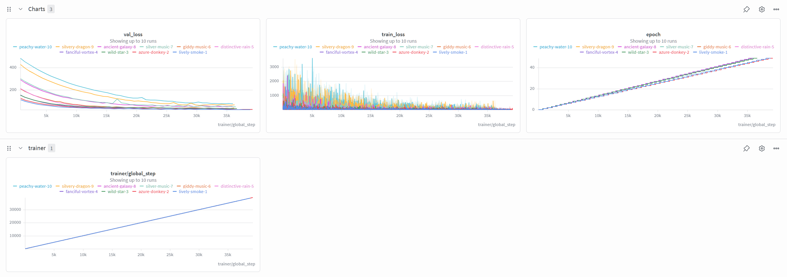
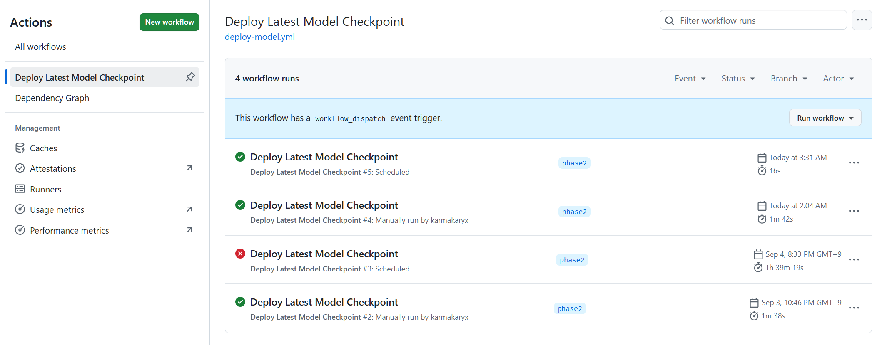
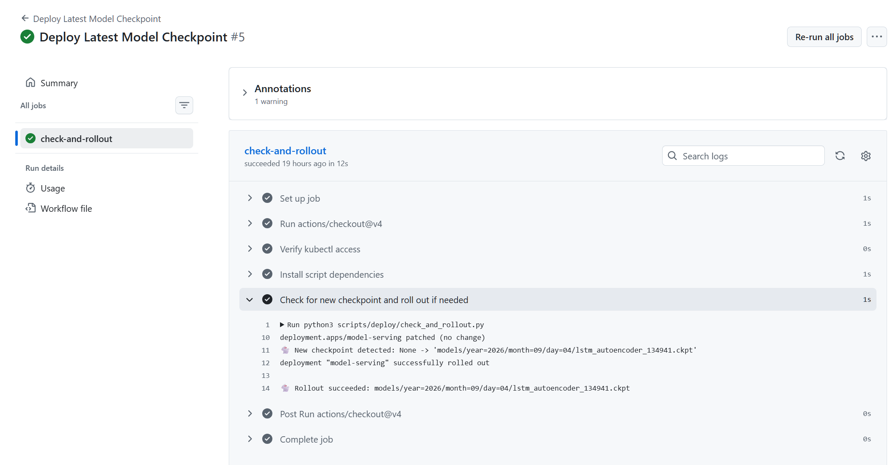

<!-- Project Name: Follow The Orbit Rabbit (ftor) -->


<div align="center">
  <h3>Space-Track TLE Data Pipeline & Collision Avoidance MLOps System using Airflow, MLflow, Kubernetes and FastAPI</h3>
</div>

## **🎥 Feature Highlights**
🚨 NOTICE: Phases 1 thru 5 will be developed sequentially. Phase 1&2 are currently open as a prerelease. 🚨
<p align="center">
  <video src="https://github.com/user-attachments/assets/c97abd70-ae9c-49ca-a059-9b3cac9e0629" width="100%" controls autoplay muted loop>
    Your browser does not support the video tag.
  </video>
</p>

<p align="center">
  [ <a href="./README.md">English</a> | <a href="./README_KR.md">한국어</a> ]
</p>

## **🛰️ Project Info**
### Project Objectives
- 위성·발사체·우주쓰레기 간 충돌 위험 이상 감지 (Collision Avoidance Anomaly Detection)
- TLE 기반 궤도 요소 변화 탐지와 공간적 근접 스크리닝을 결합한 1차 충돌 경보 MLOps 시스템 구축
- 선별된 위험 대상의 상세 충돌 확률(PoC) 예측 ML 모델 구축

### Data Collection
- Space-Track.org(CSpOC)에서 지구 궤도 위성 및 로켓 잔해(space debris)의 위치와 궤도 요소(TLE) 데이터 확보
- GP (TLE) 데이터는 LEO 기준 하루 2~4회 정도만 갱신되며 호출 권장 주기는 1시간에 1회
- 호출 횟수 제한: 분당 최대 30회 / 시간당 최대 300회
- 예측 기간 제한: SGP4/TLE 특성상 오차가 누적되므로, 향후 3~7일 이내의 단기 충돌 위험 1차 경보에 초점을 맞춤

### Tech Stack
- **Data Pipeline & Orchestration:** Airflow
- **Data Lake & Artifact Storage:** S3
- **Task-Isolated Infrastructure:** Docker
- **Model Training:** PyTorch Lightning
- **Experiment Tracking:** W&B
- **Model Registry:** MLflow
- **Inference Serving:** FastAPI
- **Local Kubernetes Cluster:** Minikube (EKS Alternative)
- **Serverless Event Trigger:** AWS Lambda
- **CI/CD Pipeline:** GitHub Actions
- **Dashboard:** Streamlit
- **Message Queue:** Amazon SQS, SNS, Lambda, DynamoDB
- **Notification Services:** Amazon SES, Slack Webhook

### Execution Schedule
- **수집:** 2시간마다
- **학습:** 매일 12:00 KST
- **CI/CD:** 모델 등록 이벤트 발생 즉시

---

## **🎬 MLOps Scenario**
### STEP 1. [수집] Data Ingestion (Airflow/S3)
- Space-Track REST API 호출
- 관심 발사체·위성군(eg. Starlink, LEO 우주쓰레기)의 TLE 전체 카탈로그(약 35,000건)를 주기적으로 증분 수집
- 퇴역일이 존재하지 않는 활성화 건만 수집
- 원본 json을 S3 `raw/` 적재 (eg. `s3://my-bucket/raw/year=2026/month=08/day=22/tle_raw_020100.json`)

### STEP 2. [전처리/가공] Preprocessing & Feature Engineering
- SGP4 및 Skyfield 라이브러리를 사용하여 좌표 변환: TLE → ECI → ECEF → LLA
- 데이터 검증: 스키마, 결측치, 값범위 체크
- 심우주·달궤도 객체 필터링: `ALT_KM` > 50,000km 제외, GEO·HEO는 유지
- 궤도 요소 기반 변동치: 경사각 $i$, 편심률 $e$, 근지점인구각 $\omega$, 평균운동 $n$ 등에서 계산하는 이상 변동치
- Screening Engine: 궤도 유사군으로 1차 필터링. KDTree 기반 공간 인덱스 (전체 조합 대신 근접 후보만 빠르게 추출)
- 상대 거리 계산: 두 객체간 거리가 설정한 근접 임계치 이내인지 평가하여 충돌 위험 후보군 선별
- parquet 포맷 변환 후 S3 `processed/` 적재 (eg. `s3://my-bucket/processed/year=2026/month=08/day=22/tle_processed_020100.parquet`)

### STEP 3. [학습/등록] Model Training & Registry (LSTM Autoencoder/W&B)
**1. 시계열 시퀀스 구성**
- 여러 시점의 processed(parquet) 스냅샷을 모아서 객체(`NORAD_CAT_ID`)별로 시계열 윈도우 구성. 데이터가 충분히 쌓이기 전까지는 짧은 윈도우로 시작하고, env 값을 조정해 나중에 윈도우를 늘릴 수 있도록 설계
- 여러 parquet 파일을 하나로 통합하고 (`NORAD_CAT_ID`, `EPOCH`) 조합 중복 제거
- `TLE_MAX_AGE_DAYS`(기본 30일)보다 epoch 오래된 행 제외 (수십 년 미갱신 객체 등)
- 객체별로 최근 `SEQUENCE_WINDOW_HOURS`(기본 3일) 구간만 잘라서, 스냅샷이 `MIN_SNAPSHOTS_PER_WINDOW` 미만이면 제외하고 나머지는 `{norad_id: {timestamps, features[T,6]}}` 형태로 반환

**2. 가변 길이 시퀀스 padding & masking**
- 객체마다 실제 갱신 빈도가 달라 시퀀스 길이(T_i)가 제각각이므로 (LEO 상시추적 객체는 촘촘 / HEO·장주기 객체는 듬성듬성), 고정 길이로 자르거나 반복해서 늘리는 대신 패딩 + 마스크로 처리해 정보 손실이나 왜곡 없이 배치 학습이 가능하도록 함
- PyTorch Dataset + `collate_fn` + masked MSE loss

**3. LSTM Autoencoder (시계열 궤도 변화 패턴 이상 감지) 모델 정의 및 PyTorch Lightning 학습 루프**
- LSTM Autoencoder 설계: Encoder LSTM → Latent State(`h_n[-1]`) 추출 → Sequence 반복 → Decoder LSTM → Reconstruction
- reconstruction loss(=재구성 오차)가 곧 궤도 이상 스코어(perturbation score)
- 패딩된 타임스텝은 학습·평가 양쪽에서 `masked_mse_loss`로 제외

**4. 모델 학습 및 등록**
- 정상적인 TLE 시퀀스(eg. 지난 30일간의 연속된 궤도 변화 흐름)를 LSTM Autoencoder에 넣어서 "정상 궤도 변화 패턴"을 압축했다가 복원하는 법 학습
- processed parquet load → 오래된 TLE 필터 → 시퀀스 구성 → 객체 기준 85/15 train/val split (data leakage 방지 처리) → 학습 → W&B logging
- W&B가 무료 티어이므로 artifact storage 소모 없도록 checkpoint와 scaler는 S3 `models/` 경로로 업로드하고 W&B에는 S3 key만 전송
- DAG는 학습과 체크포인트 업로드까지만 책임지고 K8s rolling update로 처리

### STEP 4. [추론/서빙] Inference & Serving (FastAPI/Streamlit)
- 모델 학습과 추론·서빙이 feature 로직(`sequence_builder` 등)을 그대로 공유하므로 같은 디렉토리 유지
- FastAPI serving: 특정 NORAD ID 입력 시 NORAD ID의 궤도 이상 스코어(reconstruction loss) 반환
- 위성이 갑자기 궤도를 급격히 이탈하거나 우주 쓰레기 충돌 위험 등으로 이상 궤도를 그리면, 모델이 이 패턴을 복원하지 못해 재구성 손실이 치솟게 되는데 이 오차 수치(loss) 자체를 궤도 이상 스코어(perturbation score)로 활용
- `serve.py`는 시작 시에만 S3에서 가장 최근 체크포인트를 자동으로 찾아 로드하고 핫리로드 없음
- 요청 시 S3에서 최근 processed 스냅샷들을 모아(cache 유지) 해당 객체의 시퀀스를 학습 때와 동일한 파이프라인(오래된 TLE 필터 → 윈도우 → feature 추출)으로 구성해 추론
- Streamlit으로 MVP dashboard 작성: FastAPI(`serve.py`)가 제공하는 `/health`, `/score/{norad_cat_id}` 엔드포인트를 그대로 호출만. 404, 422(스냅샷 부족) 응답을 각각 구분해서 에러 메시지로 노출

### [중간점검] Docker Compose 현황
- `ftor-ingestion`: 빌드 전용, DockerOperator가 sibling container로 씀
- `ftor-model`: 빌드 전용, `ftor_model_training` DAG가 이 이미지를 사용
- `model-training`: `ftor_model_training` DAG를 통해 매일 자동 실행됨 (수동 training은 로컬 테스트용으로만 필요시 사용)
- `model-serving`: 상시 서비스, port 8000, Airflow 대상 아님

### STEP 5. [배포/자동화] Local K8s Cluster & CI/CD (Minikube/GitHub Actions)
**1. Minikube**
- 로컬 클러스터에 Deployment + Service + HPA manifest로 모델 서빙 환경 구성
- readiness/liveness/startup probe는 `/health` 엔드포인트 사용
- 로컬 빌드된 `ftor-model:v1` 이미지를 직접 참조하며, 별도의 원격 레지스트리 push 없이 Uvicorn 서빙 실행
- 이미지는 호스트에서 한 번만 빌드하고 `minikube image load`로 복사해서 사용. 학습(Airflow)과 서빙(K8s)이 항상 동일한 이미지를 쓰도록 보장
- CI에서 Deployment annotation을 patch하면 rolling restart가 트리거되어 무중단으로 최신 모델로 갱신 (새 Pod Ready 이후에 구 Pod Terminating 되는 로그로 확인됨)
- Service는 ClusterIP로 클러스터 내부망만 개방 (외부 접근은 차후 Ingress 추가 예정)
- HPA(HorizontalPodAutoscaler)는 CPU 사용률 70% 기준으로 replica 자동 조정
- HPA 실측 검증: busybox pod로 무한 요청 루프 걸어서 CPU 1% → 400%대 상승, replica 1 → 3 자동 스케일업 확인. 부하 제거 후 CPU 즉시 떨어져도 stabilization window(~5분) 지나서야 3 → 1 스케일다운되는 것도 확인 (급격한 replica 요동 방지용 정상 설계)

**2. GitHub Actions**
- GitHub 기본 제공 러너(cloud-hosted)는 로컬 Minikube의 kubectl 컨텍스트에 접근할 방법이 없으므로, 호스트에 self-hosted runner를 직접 등록하여 상시 대기 상태로 배포
- `svc.sh`로 systemd 서비스 등록하고 active (running) 확인
- 클러스터 접근 권한은 현재 본인 머신의 로컬 kubeconfig 권한으로 실행됨. 향후 GitHub repo에 협업자 추가시 workflow를 통해 Secrets 값이나 권한이 유출될 수 있는 점 인지하고 관리 필요
- GitHub Actions에 scheduled workflow 추가, 매일 정해진 시각(학습 완료 이후 스케줄링) 자동 실행되며, 필요 시 수동 `workflow_dispatch` 실행 가능
- Airflow는 정책상 K8s 배포에 관여하지 않으며, 완전히 독립된 스크립트가 GitHub Actions 스케줄로 동작해 S3의 최신 체크포인트와 현재 Deployment를 비교한 뒤, 변경사항이 있으면 annotation을 patch하여 Pod template diff를 만들어 이미지 재빌드 없이 rolling restart trigger
- rollout이 timeout 안에 성공하지 못하면 이전 revision으로 자동 롤백

**3. AWS Lambda (Event-Driven Push Automation)**
- Airflow 학습 완료 후 S3 `models/` 경로에 새 체크포인트 파일이 업로드되면 `ftor-s3-trigger` Lambda 함수가 이를 즉시 감지
- Lambda가 GitHub REST API를 통해 repository의 `workflow_dispatch` 이벤트를 호출하여 CI/CD 배포 workflow를 자동 트리거
- 호스트의 self-hosted runner가 이 요청을 수신하여 `check_and_rollout.py` 배포 스크립트 실행
- S3의 최신 체크포인트와 현재 Deployment를 비교해 변경사항 발생 시 K8s Deployment annotation을 patch하여 Minikube 클러스터의 Rolling Restart 수행

### STEP 6. [모니터링/알림] Monitoring & Event-Driven Notification (SQS/SES)
- 알람 기준 설정 (MSGQ 임시 테스트용): 1차 screening에서 `CONJUNCTION_CANDIDATE=True`로 판정된 근접 후보를 실시간 알림 파이프라인으로 발행
- `preprocessing.py`(producer)가 거리 오름차순 정렬 후 동일 실행 내 mutual pair 중복을 제거하고, 상위 `MAX_ALERTS_PER_RUN`건만 Amazon SQS에 발행 (screening 임계값 자체는 후보군을 넉넉히 모으는 1차 필터라 그대로 알림으로 내보내면 비현실적인 건수가 나옴)
- SQS → Lambda(`ftor-alert-notifier`) 트리거로 consumer 실행: DynamoDB(`ftor-alert-history`)로 동일 NORAD 쌍 재알림을 TTL 기반 dedup window(기본 24h) 안에서 차단
- DynamoDB(`ftor-subscribers`)에 구독자별 채널(email/slack) 설정을 저장해 알림 대상과 채널을 코드 밖에서 관리
- 이메일은 Amazon SES로 구독자별 개별 발송, Slack은 Incoming Webhook으로 채널 단위 발송 (구독자 수와 무관하게 알림당 1회)
- 실패 발송 대비 SQS DLQ(`maxReceiveCount` 기준 재시도 소진 시 격리) 구성
- SES(Simple Email Service): 현재는 검증된 이메일끼리만 발송 가능한 sandbox mode. 일일 이메일 발송 한도(Daily sending quota)를 초과해서 한도 증설 필요했으나 Production Access 신청 (봇에 의해) 거절. 일해라 AWS.. 당장은 테스트 가능하니 라이브 후 구독자 증가하는 경우 재신청 예정

---

## **💡 Insights from Trial and Error**
> **PHASE 1:**
- **[STEP 1]** 프로토타입에서는 EPOCH 필터링으로 최근 3일내 갱신된 객체 100건만 수집했으나 실제 활용을 위해 전체 카탈로그 수집으로 변경. 그러면 모든 pairwise 거리 계산은 조합 수가 억 단위라 brute force로는 불가능하므로 CelesTrak, SOCRATES같은 실제 충돌 스크리닝 시스템처럼 궤도 유사군(고도대/경사각 등)으로 1차 필터링하고 KDTree로 근접 후보만 빠르게 추출

- **[STEP 2] 궤도 요소 기반 변동치**
  - 궤도 요소 (경사각/이심률/근지점인구각/승교점적경/평균운동/BSTAR) 기반 변화율: 수집 스케줄링 간격으로 비교했더니 35,052개 중 35,051개가 epoch 완전히 동일. TLE 데이터는 하루 2~4회 정도만 갱신됨을 확인 후 24시간전 스냅샷과 비교로 변경
  - 항상 "가장 최근 이전 파일 1개 vs 현재" 2개만 비교하는데 매 실행마다 `processed/` 전체 히스토리를 리스팅하고 있어서 오늘 + 어제 파티션만 리스팅하도록 변경하여 데이터가 쌓여도 조회 비용이 늘지 않게 유지
  - `DELTA_MEAN_MOTION_PER_HR`이 수백 단위로 튀는 사례 발견. `dt_hours`가 너무 작으면(수분~수초 단위) 나눗셈이 불안정해져서 정상적인 미세한 변화도 시간당 변화율로 환산하는 순간 비정상적으로 폭발할 수 있으므로 최소 간격 미만이면 변화율 계산 자체를 하지 않고 NaN 처리

- **[STEP 2]** `MIN_DISTANCE_KM == 0` (35건): 버그 아니고 실제로 물리적으로 붙어있는 객체들. `MIN_DISTANCE_KM`이 각자 TLE epoch 기준 근사치고 공통 시점 propagate 아님<br>
eg. ISS 관련 25544, 25575, 26400, 26700, 36086: ISS는 모듈(Zarya, Unity, Zvezda, Destiny, Poisk)마다 별도 NORAD ID가 부여되지만 물리적으로 하나의 구조물이라 좌표가 동일

- **[STEP 2]** `EPOCH`이 미래 날짜인 건들 검출: 컨테이너에서 실제 시스템 시각 정상 여부 확인 후 raw json을 조회하니 실제로 Space-Track이 미래 epoch을 주고 있음. `MEAN_MOTION`이 모두 1.0 rev/day 미만이라 고고도 장주기 궤도(GTO/HEO/달 궤도 근접)인데, 지상 레이더가 한 궤도 도는 동안 관측할 기회 자체가 적어 원래 며칠~2주 앞선 epoch을 주는 게 정상 동작이라고 함. 차후 `min_snapshots` 조건에서 자동 필터링되므로 수정할 필요 없음

- **[STEP 2]** 신규 발사 위성(BSTAR 추정 불안정)에서 점수가 100% BSTAR 하나에 지배당하는 문제 확인되어 `ORBITAL_DEVIATION_METRIC`(원소별 델타를 고정 스케일로 합산한 단일 점수)은 모델 입력으로 쓰지 않기로 함. 대신 원소별 델타 6개 컬럼을 그대로 모델에 입력하여 LSTM Autoencoder가 정상 패턴을 스스로 학습하게 함

- **[STEP 3]** LSTM Autoencoder가 시계열 모델이므로 개발 중에도 원본 실데이터는 꾸준히 적재하여 충분히 확보할 필요가 있음

- **[STEP 3]** `EPOCH`이 지나치게 오래된 TLE(수십 년간 갱신 안 된 객체, eg. 1965년 VENERA 2)는 실제 최신 궤도 상태를 반영 못하므로 제외. 30일 초과로 걸러진 2,733건 중 다수가 WESTFORD NEEDLES(1960년대 군사 실험 잔해 조각들)인데 위성에 타격이 안되는 미세한 구리바늘 쓰레기인지라 애초에 TLE API 수집 단계에서 이름으로 필터링 하는 것을 고려

- **[STEP 3]** LSTM Autoencoder `val_loss` 이상 급등: 원궤도(이심률≈0)에서는 "근지점"이라는 지점 자체가 물리적으로 잘 정의되지 않아서, `ARG_OF_PERICENTER`가 실제 궤도 변화와 무관하게 TLE 재피팅마다 크게 튐. 따라서 preprocessing에서 임계값 미만(원궤도)이면 `ARG_OF_PERICENTER` 델타를 NaN으로 처리

- **[STEP 3]** `sequence_builder`에서 평균/표준편차 대신 median/IQR(robust scaling)을 쓰는 이유: `DELTA_BSTAR_PER_HR` 같은 피처는 신규 발사 위성 등에서 극단치가 자주 나오는데, 평균·표준편차는 그런 극단치에 쉽게 왜곡됨 (STEP 2에서 이미 확인된 문제와 동일 원인)<br>
median/IQR은 그런 극단치 영향을 적게 받아서 "일반적인 궤도"를 기준점으로 잡기에 더 안정적

- **[STEP 3]** `sequence_builder`에서 clip(1st/99th percentile)을 같이 두는 이유: `DELTA_ARG_OF_PERICENTER_PER_HR`, `DELTA_RA_OF_ASC_NODE_PER_HR` 같은 각도 기반 델타는 preprocessing 단계에서 0/360도 경계를 넘어갈 때 wraparound 처리가 안 되어 있으면 (eg. 359.9도 → 0.1도인데 단순 차감하면 -359.8로 계산됨) 물리적으로 말이 안 되는 극단치가 섞일 수 있음 (실측: 정상 범위 IQR ~0.2 vs 실제 관측된 최댓값 67 등)<br>
이 값들이 scaling 후 그대로 들어가면 MSE loss가 소수의 이상치에 압도되므로, 학습 안정성을 위해 1st-99th percentile로 clip

- **[STEP 3]** 모델 학습에서 객체 기준 split을 쓰는 이유: `sequence_builder`가 지금은 객체당 "최신 윈도우 1개"만 만들기 때문에 사실상 객체 하나 = 샘플 하나. 시간 기준으로 자르면 한 객체의 짧은 시퀀스를 더 쪼개는 셈이라 의미가 없어 객체를 통째로 train/val에 배정. 단 객체 단위로 먼저 train/val id를 나누고, scaler는 train 객체의 원본 df 값으로만 계산 (val 정보가 스케일링에 섞여 들어가는 leakage 방지)

> **PHASE 2:**
- **[STEP 5]** 설계시 GitOps(ArgoCD 기반 자동화), Helm, Kustomize 도입을 고려했으나, 단일 모델 서빙 파이프라인 특성상 CI/CD 오버스펙으로 판단, 프로젝트의 체급과 용도에 안 맞아 제외

- **[STEP 5]** `S3_BUCKET_NAME`은 버킷명이 알려지면 private이어도 거부된(403) 요청 자체에 S3 request 과금 발생 가능하기 때문에 ConfigMap(평문 커밋)이 아니라 Secret(CLI로만 클러스터에 주입, 파일 커밋 안 함)에 배치. 별도로 S3 요청 급증 CloudWatch 알람 설정 예정

- **[STEP 5]** `load_processed_snapshots` 함수가 parquet 전체 컬럼을 읽어오면서 불필요한 TLE 문자열(69x2) 및 ECI/ECEF/LLA 좌표계 등 서빙에 안 쓰는 컬럼까지 메모리에 적재되는 문제 발견. 서빙에 필요한 핵심 컬럼(`NORAD_CAT_ID`, `OBJECT_NAME`, `EPOCH` 등)만 필터링해 읽도록 `REQUIRED_SNAPSHOT_COLS`를 지정하여 `model-serving` Pod의 반복적인 OOMKilled 방지. `print()` 버퍼링 때문에 OOMKilled 직전 로그가 안 보여서 `PYTHONUNBUFFERED=1` 추가

- **[STEP 5]** memory limit을 처음에 2Gi로 잡았다가 OOMKilled 발생. 실측하니 안정 상태 기준 ~2821Mi 소비 중이었고, 캐시 TTL 갱신 시점 메모리가 순간적으로 더 튀는 걸 확인해 여유를 두고 3.5Gi로 상향

- **[STEP 5]** 배포 직후 readinessProbe가 계속 실패해서 Pod가 Ready로 안 넘어가는 문제 발생. `serve.py`가 S3에서 체크포인트를 다운로드하는 동안 이미 liveness/readiness probe가 돌기 시작해 타임아웃으로 재시작을 반복하고 있었음. startupProbe를 별도로 추가해 초기 로딩 시간을 넉넉히 기다려주고, 그 이후부터 liveness/readiness가 넘겨받도록 분리

- **[STEP 5]** maxUnavailable: 0 / maxSurge: 1 설정으로 새 Pod가 Ready 될 때까지 기존 Pod가 트래픽을 계속 처리하는걸 확인해 replicas=1인 상태로도 무중단 배포 가능

- **[STEP 5]** systemd 서비스는 interactive shell PATH(.bashrc 등)를 안 물려받음. PATH 의존적인 도구(`uv` 등)보다 apt 설치 표준 경로 바이너리가 CI 서비스 환경에 더 안정적

- **[STEP 5]** `ftor-s3-trigger` Lambda 초기 배포 시 Handler 설정 오류로 `Runtime.HandlerNotFound` 발생. Runtime settings에서 Handler를 `lambda_function.handler`로 수정하여 해결. 이후 콘솔에서 .ckpt와 .json suffix 트리거 2개를 등록하는 과정에서 두 번째 트리거가 동일한 Statement ID로 Lambda resource policy를 덮어써서 .json 이벤트에 대한 invoke 권한이 누락되는 문제도 함께 발견하여 `aws lambda add-permission`으로 별도 Statement ID를 가진 권한을 추가하여 해결

- **[STEP 5]** `ftor-s3-trigger`는 두 suffix에 각각 독립적인 S3 event trigger가 걸려있어, 두 파일이 시간차 없이(실측상 `train.py`의 실제 업로드 간격은 1초 미만) 거의 동시에 올라오면 두 이벤트가 서로 다른 Lambda 컨테이너로 병렬 처리되면서 각자 상대 파일이 이미 존재한다고 판단해 둘 다 독립적으로 `workflow_dispatch`를 호출하는 현상 확인 (실측: 동시 업로드 시 14ms 간격으로 별도 cold start 2회 발생, 둘 다 "Checkpoint pair confirmed" 로그 출력). 반면 업로드 간격이 수십 초 이상 충분히 벌어지면 먼저 온 이벤트는 "Pair not complete yet"으로 skip되고 나중 이벤트만 dispatch되어 1번만 실행됨.<br>
다만 `check_and_rollout.py`가 annotation 비교로 멱등적으로 동작하므로, 중복 호출되어도 실제 재배포나 데이터 손상으로는 이어지지 않고 두 번째 Actions 실행은 "Already up to date"로 조기 종료됨. 근본 해결책(.json suffix 트리거만 남기고 .ckpt suffix 트리거 제거 등)은 존재하나, Phase 3에서 MLflow로 배포 트리거 체계를 예정이라 당장은 조치하지 않고 알려진 특성으로만 기록

- **[STEP 5]** 처음엔 정기적 polling(crontab) 방식을 사용했으나, GHA 스케줄러는 배송 시간을 절대 안 지키는 미친 택배기사와 같아 배포 파이프라인이 수 시간씩 지연되는 현상 발생. GitHub 내부 스케줄러의 queue 병목은 고질적이라 (정시성을 보장하지 않음을 공식 문서에서 명시) 배치 스케줄링 방식은 폐기. AWS Lambda 기반의 event-driven push 배포 파이프라인으로 전환하여, 모델이 S3에 업로드되는 즉시 배포가 실행되도록 개선 (MLOps 자동화 차원에서도 이상적)<br>
이 과정에서 GitHub 문제인지 트래킹하느라 default branch도 바꿔보고 정각 병목시간 고려해 crontab 시간도 28분처럼 분 단위로 애매하게 변경해보고 온갖 로그 뒤지고 별 삽질을 다했다.. GHA schedule은 상용 환경에서는 절대 못 쓰는 걸로..

- **[STEP 5]** GPU를 사용하지 않는데 CUDA 빌드가 통째로 설치되고 있어서 `ftor-model` 이미지가 디스크를 10.1GB나 차지하고 있었음. CPU 전용 wheel로 교체해 2.49GB로 감소. Minikube 디스크, 빌드 시간, 이미지 전송 시간 모두 절감

- **[STEP 5]** requirements가 미고정이라 재빌드 시점마다 버전이 달라질 수 있었음 (실제로 `uv.lock`의 pandas 3.0.5와 이미지의 3.0.6 불일치 확인). preprocessing이 쓴 parquet을 학습·서빙이 읽으므로 `ftor-ingestion`, `ftor-model` 두 이미지의 pandas/pyarrow/numpy 버전 고정. numpy는 `uv.lock`에 Python 버전별 마커로 2개가 존재해 컨테이너 기준(3.11) 버전을 pyproject에 명시해 단일화

- **[STEP 5]** 시작 시 체크포인트 로드에 더해 processed parquet(최대 6일치 파티션)을 S3에서 내려받아 캐시를 채우므로, startupProbe 예산과 `ROLLOUT_TIMEOUT`을 실측 기준으로 상향. 예산이 짧으면 startupProbe kill loop나 정상 기동 중인 롤아웃의 오탐 롤백이 발생하므로 콜드 스타트 시간에 여유를 둠

- **[STEP 5]** Minikube를 재생성하면 인증서와 API 서버 포트가 바뀌어 runner가 쓰는 kubeconfig가 stale해질 수 있으므로, 재생성 후 `workflow_dispatch`로 kubectl 접근 검증

- **[STEP 6]** `boto3` SQS 클라이언트가 `NoRegionError`로 즉시 실패. 원인은 `boto3`가 `AWS_REGION` 환경변수를 읽지 않고 `AWS_DEFAULT_REGION`만 읽는다는 점. S3는 리전 미지정 시 글로벌 엔드포인트(us-east-1)로 요청 후 리다이렉트로 처리되어 그동안 드러나지 않았고, 리전형 서비스인 SQS는 fallback이 없어 이번에 처음 노출됨. 코드별로 `region_name`을 넘기는 대신 .env, K8s Secret/Deployment, GitHub Actions env의 `AWS_REGION`을 `AWS_DEFAULT_REGION`으로 통일해 근본 해결

- **[STEP 6]** Lambda 함수 생성 시 기본 timeout(3s)을 그대로 두고 배포하여, DynamoDB dedup 조회 + SES 발송 + Slack HTTP 요청이 순차 실행되는 동안 타임아웃 발생. 30초로 상향 조정 후 해결

- **[STEP 6]** 1차 screening 임계값(25km)이 원래 후보군을 넉넉히 모으는 용도였는데 이를 그대로 알림 트리거로 연결하자, 실측 기준 전체 35,212개 객체 중 18,916개(과반)가 후보로 잡혀 한 번의 실행에서 수백 건의 이메일·Slack 알림이 발송됨 (trigger를 급삭제해 472건 수준에서 겨우 차단!😭). Starlink 등 근접 군집 위성이 상시로 이 거리 안에 있는 게 원인이며 버그는 아니었음. 정밀 계산 필터링을 붙이기 전까지 임시 조치로, 거리 오름차순 상위 기본 2건만 발행하도록 producer에 제한을 둠

- **[STEP 6]** consumer(Lambda)가 이메일 발송 실패 시 raise로 예외를 전파하고 있어, 구독자 여러 명 중 한 명이라도 실패하면 함수가 중단되고 dedup 기록(`_record_sent`)에 도달하지 못하는 구조였음. 그 상태로 SQS가 재시도하면 이미 성공한 구독자에게도 중복 발송되는 문제를 확인. 채널별 발송을 개별 try/except로 감싸 한쪽 실패가 다른 발송을 막지 않도록 수정하고, dedup 기록은 발송 성공/실패와 무관하게 항상 남기도록 변경

- **[STEP 6]** Slack Webhook이 특정 채널 하나에 연결된 공유 리소스인데도 구독자 순회 루프 안에서 호출되고 있어, 구독자 수만큼 같은 메시지가 채널에 중복 게시될 수 있는 구조였음. 구독자 루프 밖으로 분리해 알림당 최대 1회만 발송하도록 수정 (이메일은 반대로 수신자 개념이라 개별 발송 유지)

- **[STEP 6]** SES sandbox 모드에서 위 이슈로 인한 반복 발송 시도가 겹치며 일일 발송 한도(200통)를 짧은 시간에 소진, `Daily message quota exceeded` throttling 에러 확인. 도메인(DKIM) 인증 완료 후 Production Access 승인 요청 (하필 주말에 신청해서 이틀 넘게 대기 중.. AWS는 주말에 일 안하는군요.) → 근데 결국 거절 엔딩? spammer를 거르기 위한 절차인데 spammer만 통과 가능한 이 기괴하고 불합리한 프로세스를 AWS는 개선하시기 바랍니다.

---

## 🐞 Bug Fixes and Improvements
#### 1. S3 Data Transfer(Out) 비용 과다 지출 ($5+/month, 9/21 기준)
- **원인:** `preprocessing.py`가 매시간 방금 올린 raw json(38.1MB)을 S3에서 다시 내려받고, 24시간 전 참조 스냅샷도 매번 S3에서 새로 받아옴. 정작 raw는 로컬에 잠깐이라도 존재했던 파일인데 재활용을 안 하고 있었음
- **수정**
  - `ingestion.py`: raw 파일을 호스트 마운트 폴더에 S3 key와 동일한 경로로 먼저 저장하고, S3에는 원본 백업 목적으로만 업로드
  - `preprocessing.py`: raw는 로컬 파일 우선 읽기, 없으면 S3 fallback으로 raw 재다운로드 제거. 24시간 전 참조 스냅샷도 로컬 processed 캐시에서 우선 탐색. 정제 완료된 parquet을 로컬에도 캐시 저장
- **결과:** raw 재다운로드(월 ~27GB)와 참조 스냅샷 재다운로드(월 ~7GB) 제거. 사람 개입 없이 자동 정리(retention 기반 삭제)까지 포함해 기존 무인 자동화 원칙 유지
- **보류:** `train.py`(학습 시 72시간 초과분까지 받는 문제), `serve.py`(캐시 갱신마다 전체 재다운로드하는 구조)는 현재 비용 기여도가 작고 구조 변경 폭이 커서 Phase 3 이후 데이터가 쌓이고 필요성이 커질 때 별도로 진행

---

## 📊 MLOps Pipeline & Workflow Execution
### 1. Experiment Logger


### 2. Actions & CI/CD Workflows



---

## **📜 Project Development Log**
#### 2026-08-19
- 프로젝트 착수: Inspired by Rocket Lab (HBO documentary "Wild Wild Space"를 본 뒤)
- The Enid의 데뷔앨범을 듣다가 문득 떠오른 컨셉:<br>
*"In the region of the summer stars💫, follow the white rabbit..🐇 into the orbital debris zone.✨"*
- GitHub repository 설정

#### 2026-08-20 ~ 2026-08-21
- Space-Track.org 가입
- 개발 환경 구성 (WSL2, Docker, Airflow, etc.)
- AWS S3 bucket 생성

#### 2026-08-22 ~ 2026-08-23
- 프로젝트 아키텍처 설계
- ingestion 스크립트 작성
- 프로토타입 파이프라인 테스트 위해 최근 객체 100건만 수집하여 적재
- Dockerfile 구현, 단일 실행 검증

#### 2026-08-24 ~ 2026-08-25
- preprocessing 스크립트 작성 착수
- 전처리 단계에 해당하는 규칙 기반 알고리즘 로직 작성 위해 도메인 지식 습득
- `uv run airflow standalone` 테스트 확인
- `docker-compose.yaml` 작성
- 전체 full catalog를 1시간 간격으로 수집하도록 스케줄링 테스트
- 필수 필드 존재 여부 샘플 체크 (첫 레코드 기준)

#### 2026-08-26 ~ 2026-08-27
- 전처리, FE 2차 개발: 결과 데이터 확인하며 디버깅
- 심우주·달궤도 객체 필터링: `ALT_KM` > 50,000km 제외, GEO·HEO는 유지
- BSTAR 항이 전체 `ORBITAL_DEVIATION_METRIC`를 100% 지배하는 문제 확인 (QIANFAN 계열에서 발견)

#### 2026-08-28 ~ 2026-08-29
- AI 모델 개발 착수: S3에 전처리 완료된 parquet 파일 호출해 학습
- W&B 설정: 학습 과정 및 hyperparameter/metric은 W&B로 자동 로깅, artifact는 S3로 이원화
- LSTM Autoencoder `val_loss` 이상 급등 원인 디버깅: 극단치 138건의 이심률이 최대 0.0019로 전부 근원궤도였음
- CORS 설정

#### 2026-08-30 ~ 2026-08-31
- AI 모델 서빙 개발 착수: S3에 적재된 동일 timestamp 쌍의 checkpoint와 scaler 파일 호출해 사용
- `model-serving`은 S3에 체크포인트 존재하지 않을 경우 재시작 하도록 개발
- `model_training_dag` 작성: 수집(ingestion)은 2시간마다지만, 학습 입력이 보는 `SEQUENCE_WINDOW_HOURS`(기본 72h) window 기준으로는 하루 여러 번 재학습해도 입력 분포 변화가 거의 없으므로 매일 1회(UTC 03:00, 하루치 수집이 누적된 이후)로 설정
- MVP dashboard 작성 (Phase 3에서 React 전환 예정. 사용자 친화적인 부가기능 추가한 UI 설계 필요)

#### 2026-09-01 ~ 2026-09-02
- Streamlit dashboard 데모 영상 제작
- Phase 1 README 작성 완료
- 개발 Phase 1 사전 배포
- 개발 Phase 2 개발 착수
- Minikube 설치, 배포, HPA 부하 테스트 완료 (busybox loop)

#### 2026-09-03 ~ 2026-09-04
- Airflow Triggerer 제외
- Rollout 스크립트 작성
- GitHub에서 self-hosted runner 설정 후 등록 (GitHub Actions 상시 대기 상태)
- `workflow_dispatch` 수동 실행 테스트 완료

#### 2026-09-05 ~ 2026-09-08
- Actions runner 배포 crontab 테스트
- GHA cron 실행 방식을 AWS Lambda 기반으로 변경
- MSGQ 설계
- Phase 2 README 작성

#### 2026-09-15 ~ 2026-09-18
- `docker.sock` DooD 구조에서 호스트에 없는 컨테이너 내부 경로를 마운트하려다 실패하는 문제 방지
- annotation key에 점(.)이 포함되어 jsonpath가 경로 구분자로 오인, 항상 None을 반환해 멱등성 체크가 무력화되고 매 실행마다 불필요한 재배포가 발생하던 버그: escape 추가로 해결
- `check_and_rollout.py`의 print 로그와 kubectl 출력 순서 뒤섞임 방지 처리
- `ftor-s3-trigger` Lambda 배포 및 디버깅 완료
- 데이터 파이프라인 10일 공백 이후 재수집 초기 구간에서 `DEVIATION_LOOKBACK_HOURS`(24h) 기준 참조 스냅샷 부재로 학습용 시퀀스 부족 현상 확인. 재개 후 24h 경과 시점부터 정상화 예상
- processed 데이터 TTL은 수집 주기를 고려하여 15분에서 45분으로 조정, 근본 해결은 이벤트 기반 무효화로 예정

#### 2026-09-19 ~ 2026-09-20
- Airflow UI 로그아웃 후 자동 재로그인 문제 해결: `Dockerfile.airflow`의 `apache-airflow-providers-fab` 고정 때문에 Airflow가 3.1.8로 내려가 있었고, 로그아웃 시 `_token` 쿠키가 삭제되지 않았음. 버전 고정을 제거하고 재빌드해 Airflow 3.3.1 + FAB 3.8.0으로 정상화
- 개발 환경 완전 초기화(Docker/Minikube 이미지, 볼륨, 캐시 전체 삭제) 후 재구성
- `ftor-model` 이미지를 CPU 전용 torch로 교체
- pandas, pyarrow, numpy 버전 고정 및 두 이미지 간 일치 확인
- Minikube 리소스 재산정(cpus=4 memory=6144), HPA maxReplicas 2로 조정
- startupProbe 및 `ROLLOUT_TIMEOUT` 상향, `check_and_rollout.py` kubectl 오류 출력 개선
- AWS SES Production Access 승인 요청 및 도메인(DKIM) 인증 완료

#### 2026-09-21 ~ 2026-09-24
- MSGQ 파이프라인 개발 및 테스트 완료
- 이메일·Slack 자동 발송 및 수신 확인 완료
- Simple Notification Service 토픽 추가 및 구독자 추가로 메일 스팸 처리 대응
- 데이터 수집 주기 조정 (2시간마다)
- raw 로컬 우선 저장 로직 추가 및 정제시 raw 재다운로드 제거
- 포트폴리오를 위한 EC2 배포 및 도메인 연결
- Phase 3 개발 착수: 범위 결정

---

## **⚙️ Components**
### Architecture
Under design..

### Directory
```
├── .github/                      # GitHub Actions CI/CD 자동화 스크립트
│   └── workflows/
│       └── deploy-model.yml
├── .venv/...                     # (GitHub 관리 제외)
├── assets/...                    # README images
├── dags/                         # (GitHub 관리 제외)
│   ├── ingestion_dag.py          # Space-Track TLE 수집 및 전처리 DAG
│   └── model_training_dag.py     # LSTM Autoencoder 학습 DAG
├── dashboard/                    # serve.py의 HTTP API만 호출하는 임시 MVP UI
│   ├── requirements.txt          # dashboard dependencies
│   └── streamlit_app.py          # Streamlit app
├── data/...                      # raw/ 참조 스냅샷 로컬 캐시 (GitHub 관리 제외)
├── data-prepare/
│   ├── Dockerfile                # ingestion/preprocessing 컨테이너 이미지
│   ├── ingestion.py              # 카탈로그 수집, 검증, 적재
│   ├── preprocessing.py          # 좌표변환, 검증, 궤도 변동치, 근접 스크리닝
│   └── requirements.txt          # ingestion/preprocessing dependencies
├── k8s/                          # Kubernetes Manifest
│   ├── 00-namespace.yaml
│   ├── 01-configmap.yaml
│   ├── 02-secret.yaml.example
│   ├── 03-deployment.yaml
│   ├── 04-service.yaml
│   └── 05-hpa.yaml
├── lambda/
│   ├── alert_notifier.py         # 충돌 후보 SQS 알림 발송 (GitHub 관리 제외)
│   └── s3_trigger.py             # S3 event trigger
├── model/                        # 학습과 서빙이 feature 로직 공유
│   ├── Dockerfile                # 학습·서빙 겸용 컨테이너 이미지
│   ├── model.py                  # LSTM Autoencoder 정의
│   ├── requirements.txt          # training/serving dependencies
│   ├── sequence_builder.py       # 객체별 윈도우 묶기, gap 처리 (GitHub 관리 제외)
│   ├── serve.py                  # FastAPI inference serving
│   ├── torch_dataset.py          # padding & masking
│   └── train.py                  # 시퀀스 구성, 학습, W&B logging
├── scripts/                      # 배포 자동화 스크립트
│   └── deploy/
│       ├── check_and_rollout.py
│       └── requirements.txt
├── .env                          # 실제 환경변수
├── .env.example                  # 환경변수 템플릿
├── .gitignore
├── docker-compose.yml            # (GitHub 관리 제외)
├── Dockerfile.airflow            # Airflow 이미지
├── pyproject.toml                # 프로젝트 의존성 정의
├── README_KR.md
├── README.md
└── uv.lock                       # 의존성 lock 파일
```

---

## **💁🏻‍♀️ Disclaimer**
지적재산권(IP) 보호를 위해 독자적인 궤도 전파 알고리즘 및 미세 조정된 위험 평가 모델의 가중치 등은 마스킹 처리되어 있습니다.<br>
본 저장소는 가상 평가 모듈을 활용하여 end-to-end MLOps 인프라 및 파이프라인의 핵심 기능을 시연합니다.<br>
<br>

<p align="center"><b>Copyright © 2026 Mua💋無我 by Karyx💫. All Rights Reserved.</b></p>
